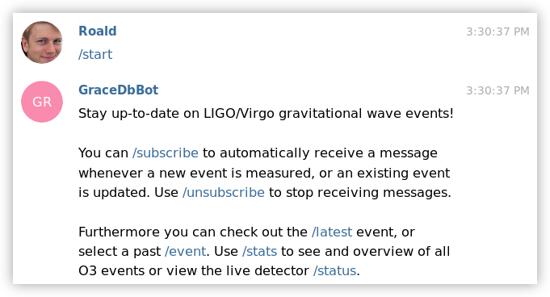
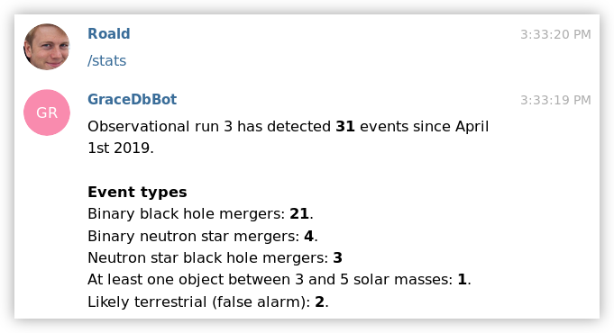

# GraceDbBot
A Telegram bot which you can use to get information on gravitational wave events 
from LIGO/Virgo. 

## Usage
~~Add the bot by searching for **GraceDbBot** on Telegram or click [here](https://t.me/GraceDbBot).~~ Bot is down and project is archived. To host it yourself see [below](#installation-for-self-hosting) 

Currently the bot responds to the following commands:

### `/help` or `/start` 
Shows a welcome message and an overview of all possible commands.



### `/latest`
Shows the latest measured event.


### `/event`
Select an event where you want to see the details of.


### `/stats` 
Shows an overview of all measured events during observational run 3.



### `/status`
Shows the current status of all three detectors.


### `/subscribe` and `/unsubscribe`
After subscribing you will automatically receive a message when a new event was 
measured or an existing event was updated or retraced.


## Installation for self hosting

If you want to host the bot yourself, you can install it as follows.

1. Clone this repo

	```
	git@github.com:Roald87/GraceDB.git
	```

2. Create a new virtual environment with pip or conda

	```bash
	conda create -n gracebot python=3.7 
	conda activate gracebot
	# not all package are available for installation via conda
	pip install -r ~/path/to/gracebot/requirements.txt
	```

	```bash
	# Install venv to create virtual environments
	python3 -m pip install --user venv
	# Create a new virtual environment
	python3 -m venv gracebot
	# Activate the virtual environment you just created
	source gracebot/bin/activate
	# Install required packages 
	pip install -r ~/path/to/gracebot/requirements.txt

	```

3. Create a new telegram bot via the instructions [here](https://core.telegram.org/bots#3-how-do-i-create-a-bot).

4. Create a new file `/path/to/gracebot/gracebot/config.py`.

5. Add the following five variables to `config.py`. For `API_TOKEN` use the token you were given when you registered the new bot. **Do not share this api token or any of the other variables in this file with anyone, since it can be used to control your bot.** Then ` secret`, `preliminary_command`, `update_command` and `retraction_command` should be hard to guess randomized strings. You can generate these yourself. They are used to trigger bot commands. 

	```python
	API_TOKEN = '110201543:AAHdqTcvCH1vGWJxfSeofSAs0K5PALDsaw'
	secret = '2eh4y5gqfliqoy2t'
	preliminary_command = 'fjsapdofih9328fhjdsa'
	update_command = 'adsfj933092hpajsvbdfa32'
	retraction_command = 'q23tgrgaqgn3ooq3g'
	```

6. Download [ngrok](https://ngrok.com/download) and register an account to expose gracebot to the internet.

7. Create a file `/path/to/ngrok/config.yml` and add your authtoken to the config file

	```yml
	authtoken: dfasj8oiafh3fsadjfhsdjfha
	tunnels:
	    default:
	        proto: http
	        addr: 8080
	```

8. Start the ngrok tunnel

	```bash
	cd ~; nohup ngrok/ngrok start --all --config="ngrok/config.yml" &
	```

9. Start gracebot and the listener which listens for new events

	```bash
	# Activate the virtual environment
	source ~/path/to/venvs/gracedb/bin/activate
	printf 'Starting GraceBot.'
	cd ~/path/to/gracebot/
	nohup python3 gracebot/main.py > gracebot.out 2>&1&
	sleep 3
	printf 'Starting GCN listener.'
	nohup python gracebot/listener.py > listener.out 2>&1&
	```

## Disclaimer
I'm not an expert on gravitational waves. So if you see something which doesn't make sense, please let me know.
